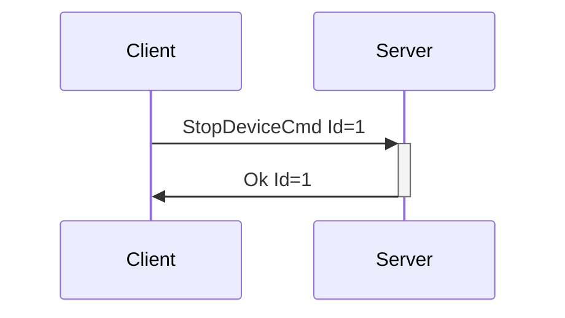
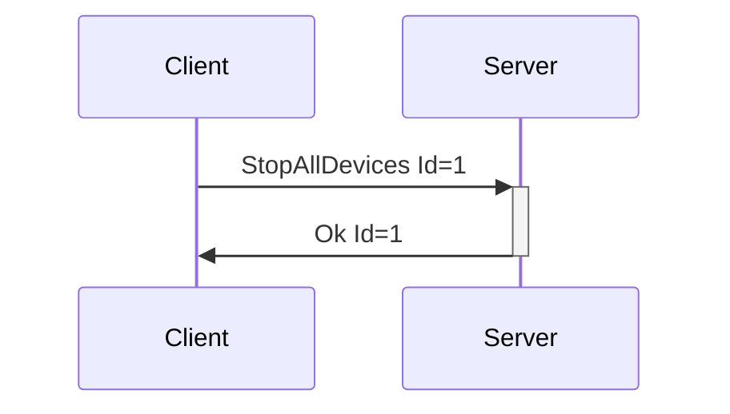
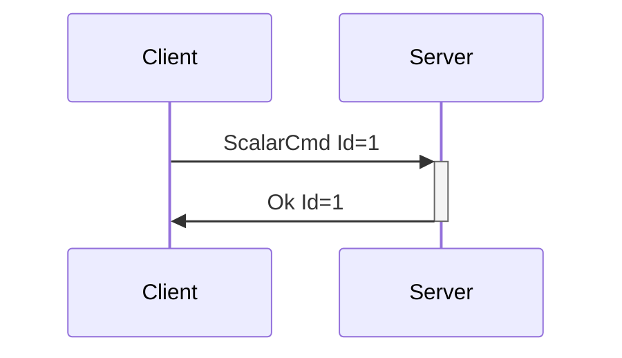
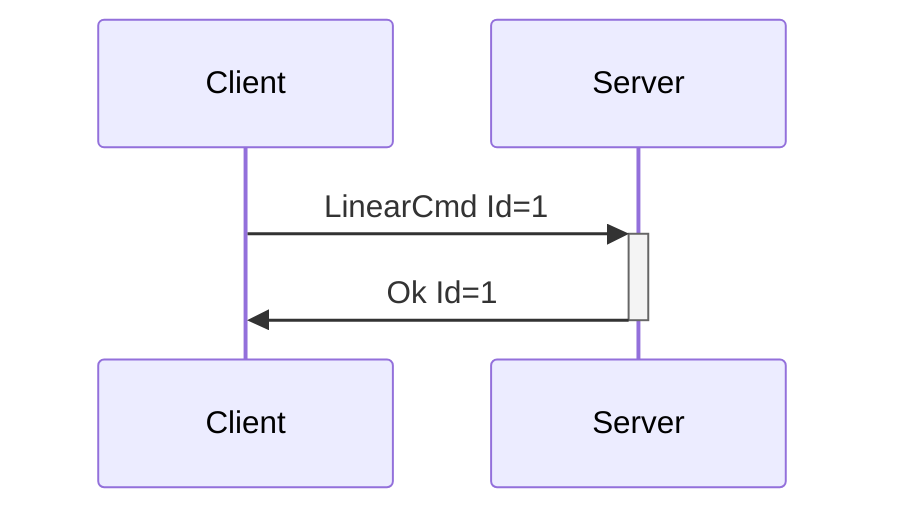
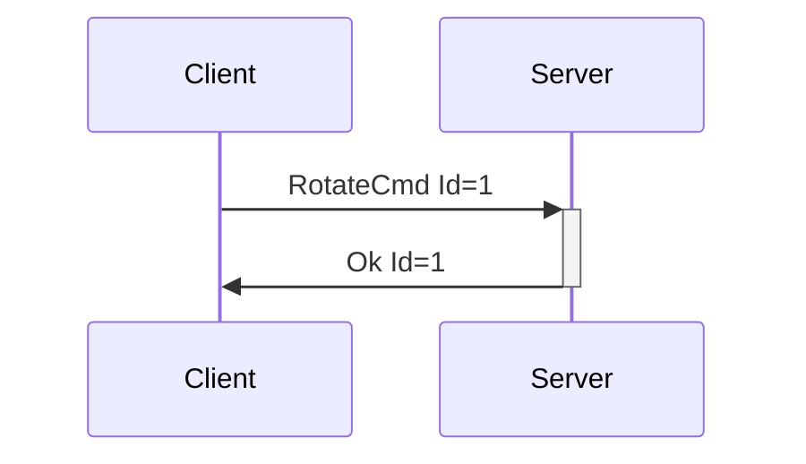

# Generic Device Messages

Generic device messages pertain to classes of devices, versus specific devices. For instance, the
generic VibrateCmd should be supported by all vibrating devices, and StopDeviceCmd should be
supported by all devices in order to stop them from whatever their current action may be.

---
## StopDeviceCmd

**Description:** Client request to have the server stop a device from whatever actions it may be
taking. This message should be supported by all devices, and the server should know how to stop any
device it supports.

**Introduced In Spec Version:** 0

**Last Updated In Spec Version:** 0

**Fields:**

* _Id_ (unsigned int): Message Id
* _DeviceIndex_ (unsigned int): Index of device to stop.

**Expected Response:**

* Ok message with matching Id on successful request.
* Error message on value or message error.

**Flow Diagram:**



**Serialization Example:**

```json
[
  {
    "StopDeviceCmd": {
      "Id": 1,
      "DeviceIndex": 0
    }
  }
]
```
---
## StopAllDevices

**Description:** Sent by the client to tell the server to stop all devices. Can be used for
emergency situations, on client shutdown for cleanup, etc… While this is considered a Device
Message, since it pertains to all currently connected devices, it does not specify a device index
(and does not end with 'Cmd').

**Introduced In Spec Version:** 0

**Last Updated In Spec Version:** 0

**Fields:**

* _Id_ (unsigned int): Message Id

**Expected Response:**

* Ok message with matching Id on successful request.
* Error message on value or message error.

**Flow Diagram:**



**Serialization Example:**

```json
[
  {
    "StopAllDevices": {
      "Id": 1
    }
  }
]
```
---
## ScalarCmd

**Description:** Sets the static level for a feature. For instance, the vibration speed of a
vibrator, the oscillating speed of a fucking machine, etc... The [Message
Attributes](enumeration.md#messageattributes) for the ScalarCmd message in the
[DeviceList](enumeration.md#devicelist)/[DeviceAdded](enumeration.md#deviceadded) message contain
information on the actuator type and description, number of actuators, level ranges, and more.

Due to the amount of different controls that are scalars within haptics (vibration speed,
oscillation speed, inflate/constrict pressures, etc), this message provides flexibility to add new
acutuation types without having to introduce new messages into the protocol. The values accepted as
actuator types can be extended as needed.

In practice, ScalarCmd is meants to be exposed to developers via crafted APIs, i.e. having
vibrate()/rotate()/oscillate() etc functions available on a data structure that represents a device,
with the actuator types denoting which of those methods may be allowed. The ScalarCmd itself can be
exposed via API also, but this may lead to a lack of attention to context that could cause issues
(i.e. someone driving a vibrator and a fucking machine with the same power signals). Mitigation for
that type of issue may be UX related versus system/protocol related, by letting users set speed
limits and ranges for devices.

**Introduced In Spec Version:** 3

**Last Updated In Spec Version:** 3

**Fields:**

* _Id_ (unsigned int): Message Id
* _DeviceIndex_ (unsigned int): Index of device
* _Scalars_ (array): Scalar values to set actuators
  * _Index_ (unsigned int): Index of actuator
  * _Scalar_ (double): Actuator level with a range of [0.0-1.0]
  * _ActuatorType_ (string): Type of actuator that the user expects to control with this command.
    This is to make sure that context is correct between the client and server.

**Expected Response:**

* Ok message with matching Id on successful request.
* Error message on value or message error.

**Flow Diagram:**



**Serialization Example:**

```json
[
  {
    "ScalarCmd": {
      "Id": 1,
      "DeviceIndex": 0,
      "Scalars": [
        {
          "Index": 0,
          "Scalar": 0.5,
          "ActuatorType": "Vibrate"
        },
        {
          "Index": 1,
          "Scalar": 1.0,
          "ActuatorType": "Inflate"
        }
      ]
    }
  }
]
```
---

## LinearCmd

**Description:** Causes a device that supports linear movement to move to a position over a certain
amount of time. Devices with multiple linear actuator features may take multiple values. The length
of the [Message Attributes array](enumeration.md#messageattributes) for the message in the
[DeviceList](enumeration.md#devicelist)/[DeviceAdded](enumeration.md#deviceadded) message will
contain that information.

**Introduced In Spec Version:** 1

**Last Updated In Spec Version:** 1

**Fields:**

* _Id_ (unsigned int): Message Id
* _DeviceIndex_ (unsigned int): Index of device
* _Vectors_ (array): Linear actuator speeds and positions
  * _Index_ (unsigned int): Index of linear actuator
  * _Duration_ (unsigned int): Movement time in milliseconds
  * _Position_ (double): Target position with a range of [0.0-1.0]

**Expected Response:**

* Ok message with matching Id on successful request.
* Error message on value or message error.

**Flow Diagram:**



**Serialization Example:**

```json
[
  {
    "LinearCmd": {
      "Id": 1,
      "DeviceIndex": 0,
      "Vectors": [
        {
          "Index": 0,
          "Duration": 500,
          "Position": 0.3
        },
        {
          "Index": 1,
          "Duration": 1000,
          "Position": 0.8
        }
      ]
    }
  }
]
```
---
## RotateCmd

**Description:** Causes a device that supports rotation to rotate at a certain speeds in specified
directions. Devices with multiple rotating features may have multiple values. The length of the
[Message Attributes array](enumeration.md#messageattributes) for the message in the
[DeviceList](enumeration.md#devicelist)/[DeviceAdded](enumeration.md#deviceadded) message will
contain that information.

**Introduced In Spec Version:** 1

**Last Updated In Spec Version:** 1

**Fields:**

* _Id_ (unsigned int): Message Id
* _DeviceIndex_ (unsigned int): Index of device
* _Rotations_ (array): Rotation speeds
  * _Index_ (unsigned int): Index of rotation motor
  * _Speed_ (double): Rotation speed with a range of [0.0-1.0]
  * _Clockwise_ (boolean): Direction of rotation (clockwise may be subjective)

**Expected Response:**

* Ok message with matching Id on successful request.
* Error message on value or message error.

**Flow Diagram:**



**Serialization Example:**

```json
[
  {
    "RotateCmd": {
      "Id": 1,
      "DeviceIndex": 0,
      "Rotations": [
        {
          "Index": 0,
          "Speed": 0.5,
          "Clockwise": true
        },
        {
          "Index": 1,
          "Speed": 1.0,
          "Clockwise": false
        }
      ]
    }
  }
]
```

