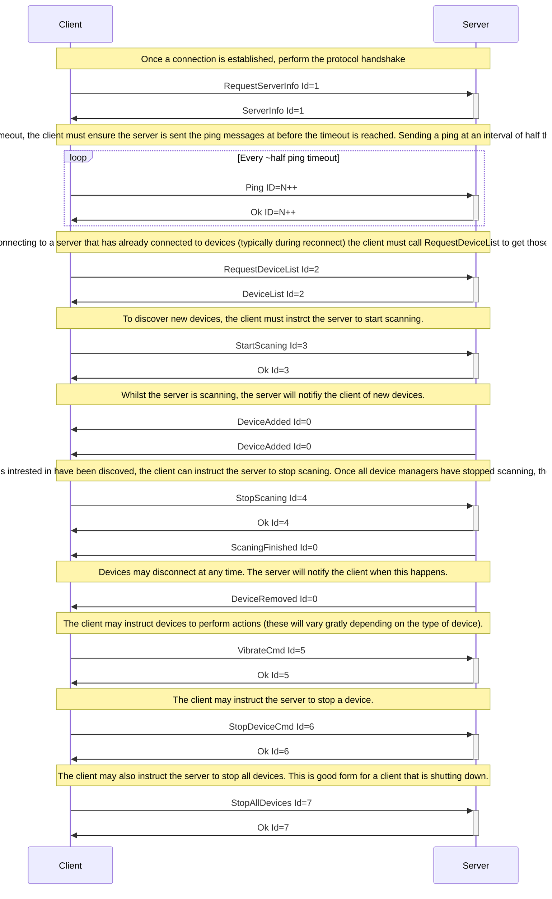

# Architecture

## Protocol

The Buttplug Standard defines a message based protocol between a client and a server. Note that the use of client and server here does not explicitly denote network connection. These terms are used as a generic way to denote different communication endpoints.

Client are expected to request information from the server about devices that are connected, and to send information to those devices via the server. Servers will handle device enumeration, connection management to hardware, and failure recoveries \(for instance, stopping all connected devices on client disconnect\).

While serialization formats are not yet standardized, current references implementations of the Standard use JSON for serialization. More information on this is available in the Messages section.

## Stages

Buttplug sessions consist of 3 stages. While these stages need not be discrete, due to the way Buttplug will likely be used, they will usually end up being so. Applications may hide or combine some of the stages depending on requirements.

### Identification

During the identification stage, a client will establish connection with the server, and send over its identifying information. The server may trigger some sort of UI event at this point to ask if the user will allow the client to connect and interact.

### Enumeration

After the client/server connection is set up, device enumeration can begin. The client can ask the server to scan for devices on various busses or media \(serial, usb, bluetooth, network, etc\), and return a list of devices it can communicate with.

### Consummation

Once devices are found and selected, we can assume the user will begin interacting with connected devices. At this point, the client will mostly be sending and receiving device commands. It can usually \(but not always\) be assumed that continued enumeration may not be possible due to the context of situations that Buttplug software will be used in.

### Example lifecycle

The following lifecycle covers the general message flow expected between a Buttplug client and a Buttplug server.

