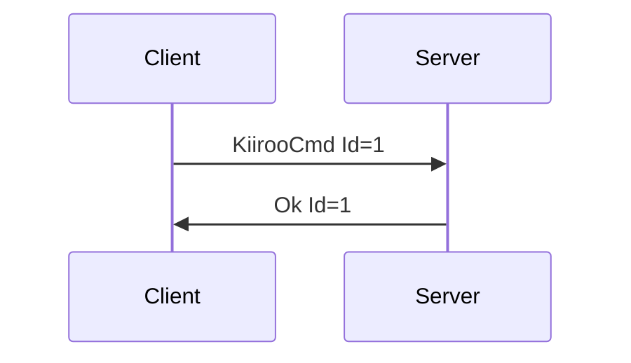
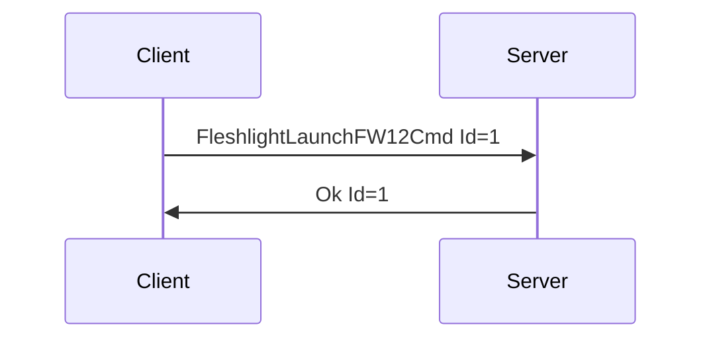
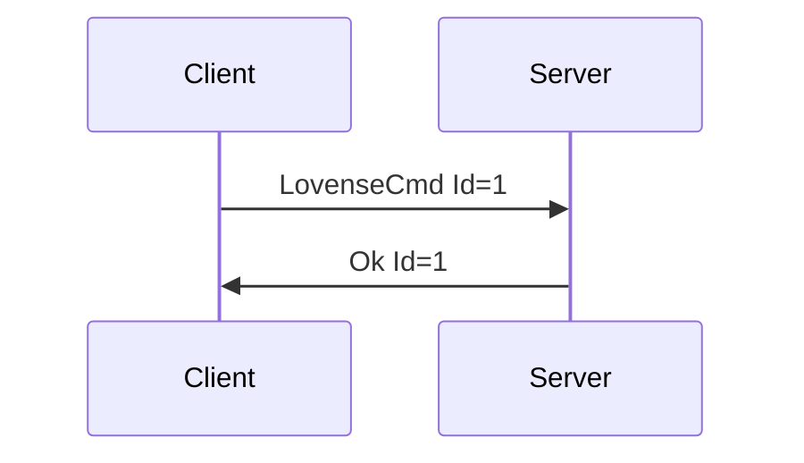
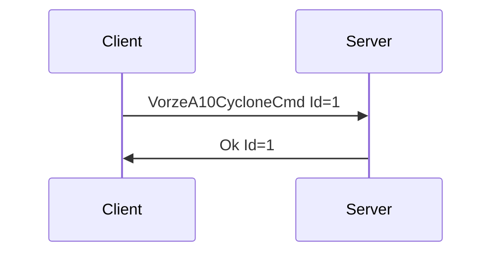

# Specific Device Messages

## KiirooCmd

**Description:** Causes a device that supports Kiiroo style commands to run whatever event may be related. More information on Kiiroo commands can be found in STPIHKAL.

**Introduced In Version:** 0

**Message Version:** 0

**Fields:**

* _Id_ \(unsigned int\): Message Id
* _DeviceIndex_ \(unsigned int\): Index of device
* _Command_ \(string\): Parsed into an unsigned integer in range \[0-4\] for position/speed.

**Expected Response:**

* Ok message with matching Id on successful request.
* Error message on value or message error.

**Flow Diagram:**



**Serialization Example:**

```json
[
  {
    "KiirooCmd": {
      "Id": 1,
      "DeviceIndex": 0,
      "Command": "4"
    }
  }
]
```

## FleshlightLaunchFW12Cmd

**Description:** Causes a device that supports Fleshlight Launch \(Firmware Version 1.2\) style commands to run whatever event may be related. More information on Fleshlight Launch commands can be found in STPIHKAL.

**Introduced In Version:** 0

**Message Version:** 0

**Fields:**

* _Id_ \(unsigned int\): Message Id
* _DeviceIndex_ \(unsigned int\): Index of device
* _Position_ \(unsigned int\): Unsigned integer in range \[0-99\], denoting position to move to.
* _Speed_ \(unsigned int\): Unsigned integer in range \[0-99\], denoting speed to requested position at.

**Expected Response:**

* Ok message with matching Id on successful request.
* Error message on value or message error.

**Flow Diagram:**



**Serialization Example:**

```json
[
  {
    "FleshlightLaunchFW12Cmd": {
      "Id": 1,
      "DeviceIndex": 0,
      "Position": 95,
      "Speed": 90
    }
  }
]
```

## LovenseCmd

**Description:** Causes a device that supports Lovense style commands to run whatever event may be related. More information on Lovense commands can be found in STPIHKAL.

**Introduced In Version:** 0

**Message Version:** 0

**Fields:**

* _Id_ \(unsigned int\): Message Id
* _DeviceIndex_ \(unsigned int\): Index of device
* _Command_ \(string\): String command for Lovense devices. Must be a valid Lovense command accessible on most of their devices. See STPIHKAL for more info. Implementations should check this for validity.

**Expected Response:**

* Ok message with matching Id on successful request.
* Error message on value or message error.

**Flow Diagram:**



**Serialization Example:**

```json
[
  {
    "LovenseCmd": {
      "Id": 1,
      "DeviceIndex": 0,
      "Command": "Vibrate:20;"
    }
  }
]
```

## VorzeA10CycloneCmd

**Description:** Causes a device that supports Vorze A10 Cyclone style commands to run whatever event may be related. More information on Vorze commands can be found in STPIHKAL.

**Introduced In Version:** 0

**Message Version:** 0

**Fields:**

* _Id_ \(unsigned int\): Message Id
* _DeviceIndex_ \(unsigned int\): Index of device
* _Speed_ \(unsigned int\): Unsigned integer in range \[0-100\], denoting speed to rotate at.
* _Clockwise_ \(boolean\): Rotation direction

**Expected Response:**

* Ok message with matching Id on successful request.
* Error message on value or message error.

**Flow Diagram:**



**Serialization Example:**

```json
[
  {
    "VorzeA10CycloneCmd": {
      "Id": 1,
      "DeviceIndex": 0,
      "Speed": 50,
      "Clockwise": true
    }
  }
]
```
